> **回归分析（Regression Analysis）**

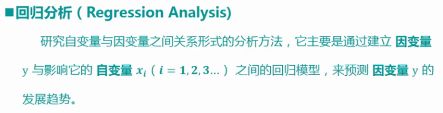](assets/markdown-img-paste-20170803123131244.png)

回归分析的分类
* 线性回归分析
  * 简单线性回归
  * 多重线性回归
* 非线性回归分析
  * 逻辑回归
  * 神经网络

简单线性回归模型

```python
y = a + bx + e
#y 因变量
#x 自变量
#a 常数项
#b 回归系数，斜率
#e 随机误差
```

>回归分析步骤
1. 根据预测目标，确定自变量和因变量
2. 绘制散点图，确定回归模型类型
3. 估计模型参数，建立回归模型
4. 对回归模型进行检验
5. 利用回归模型进行预测

案例

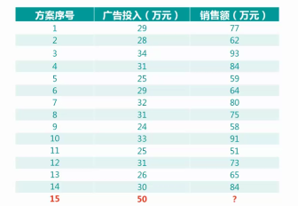

问题：投入50万的广告费用，能够带来多少的销售额？

步骤一、根据预测目标，确定自变量和因变量

广告费用是自变量，销售额是因变量

步骤二、绘制散点图，确定回归模型类型

在简单线性回归分析中，只要确定自变量与因变量之间的相关度为强相关性，即可确定可以建立简单线性回归方程

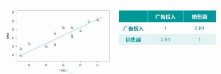

步骤三、估计模型参数，建立回归模型

要得到回归模型，就要先估计出回归模型的参数a和b

最小二乘法，通过最小化误差的平方和，寻找数据的最佳直线，这个误差就是实际观测点和估计点之间的距离

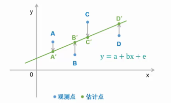

步骤四、对回归模型进行检验

回归方程的精度就是用来表示实际观测点和回归方程的拟合程度的指标，使用判定系数来度量

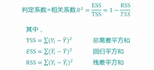

步骤五、利用回归模型进行预测

根据已有的自变量数据，预测需要的因变量对应的结果

API
sklearn建模流程

```python
#建立模型：
IrModel = sklearn.linear_model.LinearRegression()

#训练模型：
IrModel.fit(x,y)

#模型评估
IrModel.score(x,y)

#模型预测
IrModel.predict(x)
```

> **多重线性回归（Multiple Linear Regression）**

多重线性回归模型

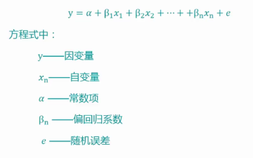

案例

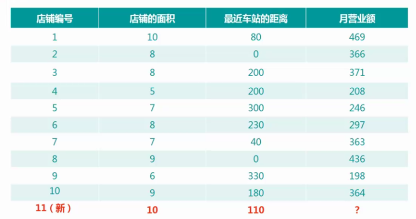

步骤一、根据预测目标，确定自变量和因变量

因变量：月营业额
自变量：店铺面积、最近车站距离

步骤二、绘制散点图，确定回归模型类型

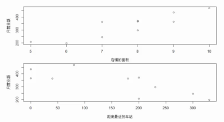

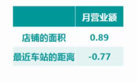

步骤三、估计模型参数，建立回归模型

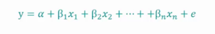

步骤四、对回归模型进行检验


步骤五、利用回归模型进行预测

根据已有的自变量数据，预测需要的因变量对应的结果

API
矩阵数据绘制散点图

```python
pandas.tools.plotting.scatter_matrix(matrix,figsize,diagonal)
#matrix 矩阵
#figsize 图形大小
#diagonal kde为直方图
```

> **一元非线性回归（Univariate Nonline）**

在回归分析中，只包括一个自变量和一个因变量，且二者的关系可用一条曲线近似表示，则称为一元非线性回归分析

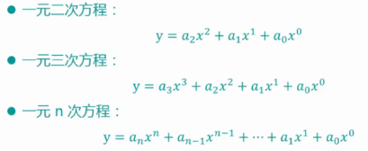

案例

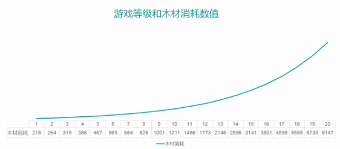

求解：一元非线性回归方程转为多元一次回归方程

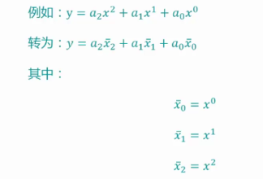

API
一元n次方程，转多元线性方程

```python
pf = sklearn.preprocessing.PolynomialFeatures(degree=2)
#degree 回归方程的次数

#转换方法
x_2_fit = pf.fit_transform(x)
```

> **逻辑回归（Logistic Regression）**

针对因变量为分类变量而进行回归分析的一种统计方法，属于概率型非线性回归。目的是把非线性问题转化为线性问题，这样就可以使用线性回归的相关理论和方法来解决非线性回归的问题

优点：算法易于实现和部署，执行效率和准确度高
缺点：离散型的自变量数据需要通过生成虚拟变量的方式来使用

方程

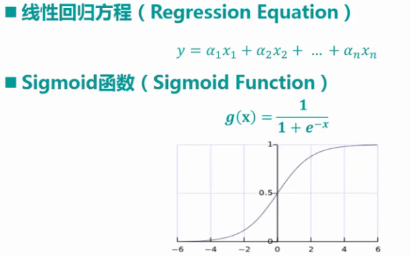

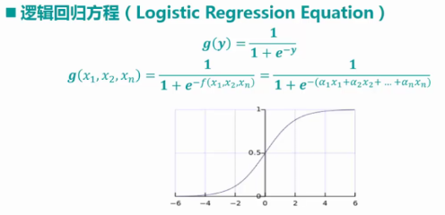
