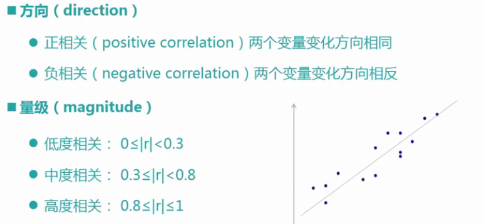
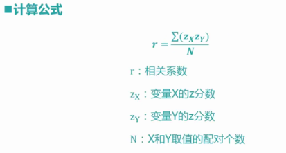
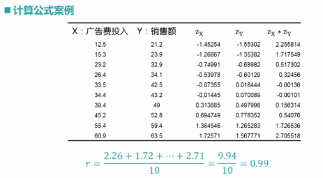
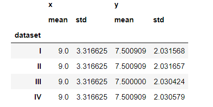
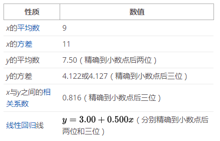
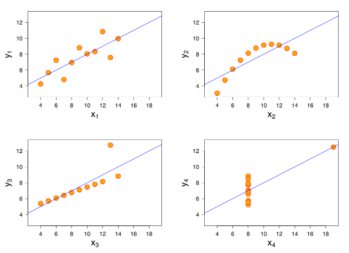

## 相关分析

世界是一个普遍联系的有机整体，现象之间客观上存在着某种有机联系，一种现象的发展变化，必然受与之相关联的其它现象发展变化的制约与影响，在统计学中，这种关系可以分为相关分析与回归函数分析两大类。

**相关性指标的研究意义**

相关系数（correlation coefficient）：相关系数是变量间关联程度的最基本测度之一

我们在研究两个变量之间的关系时，有着个体因素的感觉性干扰，所以我们才需要通过一个指标从整体上来查看两个变量之间的相关性，也就是需要一个判定变量之间相关性的判定指标。

相关分析（correlation analysis）：是研究现象之间是否存在某种依存关系，并对具体有依存关系的现象探讨其相关方向以及相关程度，是研究随机变量之间的相关关系的一种统计方法

**相关系数的基本特征**




在进行相关分析之前，通常会通过绘制散点图来观察变量之间的相关性，如果这些变量在二维坐标轴中构成的数据点分布在一条直线的周围，就说明变量之间存在线性相关关系。

**如何计算相关系数**





* 手工计算相关系数
```python
import numpy

X = [
    12.5, 15.3, 23.2, 26.4, 33.5,
    34.4, 39.4, 45.2, 55.4, 60.9
]
Y = [
    21.2, 23.9, 32.9, 34.1, 42.5,
    43.2, 49.0, 52.8, 59.4, 63.5
]

#均值
XMean = numpy.mean(X)
YMean = numpy.mean(Y)

#标准差
XSD = numpy.std(X)
YSD = numpy.sed(Y)

#z分数
ZX = (X-XMean)/XSD
ZY = (Y-YMean)/YSD
#每个值减去向量的均值，再除以标准差

#相关系数
r = numpy.sum(ZX*ZY)/(len(X))
```

* 调用Numpy内置的方法计算

```Python
r = numpy.corrcoef(X,Y)
```

* 调用Pandas自带的方法计算
```Python
import pandas

data = pandas.DataFrame({
  'X': X,
  'Y': Y
  })

data.corr()
```

**API**

相关系数计算方法
```python
numpy.corrcoef(X,Y)
#X 向量1
#Y 向量2

DataFrame.corr()
#返回相关系数矩阵
```

**作业**

网上搜索“安斯库姆四重奏”，理解统计指标的局限性


**安斯库姆四重奏**

四组基本统计特性（均值，中值，方差）一致的数据，绘制出来的图表却截然不同

每一组数据都包含了11个(x,y)点，这四组数据由统计学家弗朗西斯·安斯库姆（Francis Anscombe）构造，目的在于说明分析数据前先绘制图表的重要性，以及离群值对统计的影响之大








```Python

```
