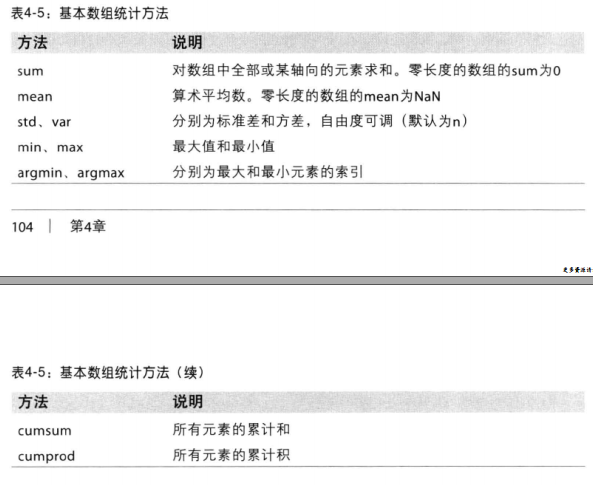
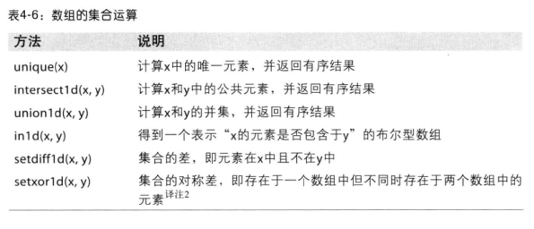
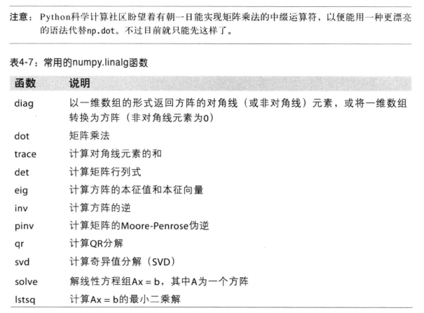
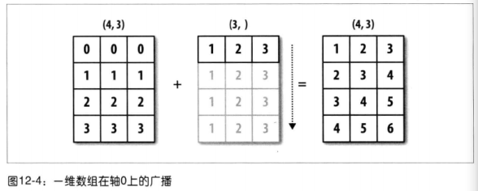
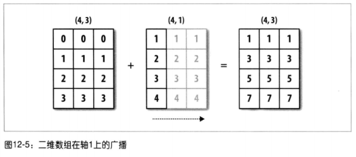
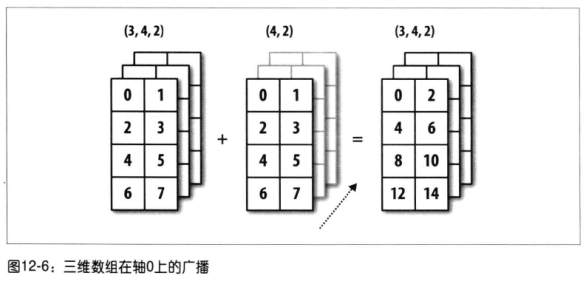
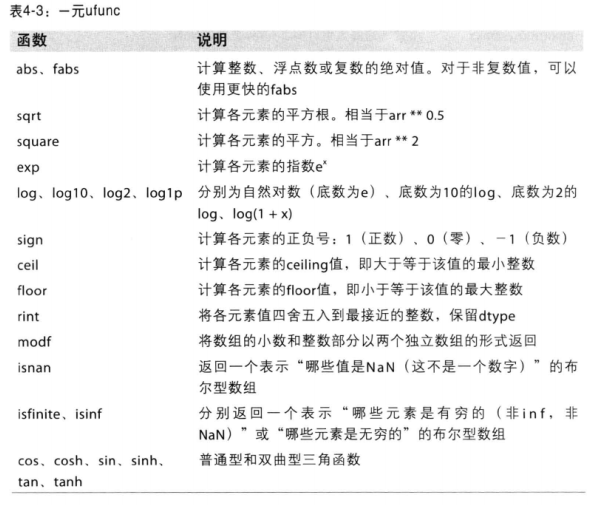
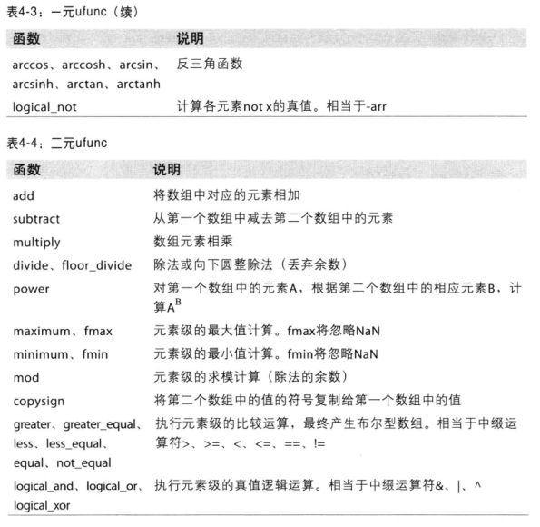
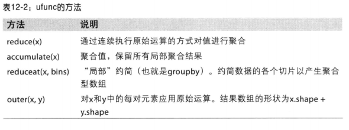

### numpy.where()
`numpy.where`函数是三元表达式 `x if condition else y` 的矢量化版本。
```py
numpy.where(cond,xarr,yarr)
#cond 为判断条件,数组
#xarr 条件为真时的返回值，可为数组或者标量
#yarr 条件为假时的返回值
```

*可不可像if一样用于嵌套的表达呢*

### 数学和统计方法



### 唯一化与其它的集合逻辑



### 线性代数



*现在已经可以用@符号实现矩阵乘法的中缀运算符了

### 数组重塑
只需向数组的实例方法reshape传入一个表示即可实现“无需复制任何数据，数组就能从一个形状转换为另一个形状”
```py
arr = np.arange(8) #1*8
arr.reshape((4,2)) #4*2
arr.reshape((2,-1)) #-1表示维度的大小由数据本身推断而来

other_arr=np.ones((2,4))
arr.reshape(other_arr.shape) #传入一个其它数组的shape
```

与reshape将一维数组转换为多维数组的运算过程相反的运算通常称为扁平化或散开：
```python
ones((3,5)).ravel() #源数据
ones((3,5)).flatten() #产生副本
```

### C和Fortran顺序
Numpy数组是按行优先顺序创建的，行与列优先顺序又分别称为C和Fortran顺序。像reshape和reval这样的函数，都可以接受一个表示数组存放顺序的order参数，一般是'C'或'F'。
```py
arr.ravel('F') #返回列优先的散开数组
```

### 数组合并与拆分


### 广播
广播是指不同形状的数组之间的算术运算的执行方式，将标量值跟数组合并时就会发生最简单的广播：
```python
arr=np.arange(5)
arr*4
```
广播的原则：如果两个数组从末尾开始算起的维度的轴长度相符或其中一方的长度为1，则认为他们是广播兼容的。广播会在缺失或长度为1 的维度上进行。







根据广播的原则，较小数组的“广播维”必须为1

### 通用函数ufunc
通用函数是一种对ndarray中的数据执行元素级运算的函数。






