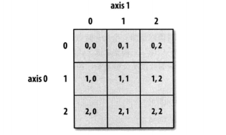
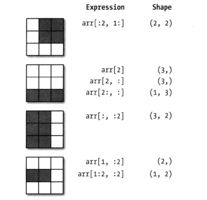

### NumPy的ndarray：一种多维数组对象

#### 创建数组最简单的方法就是使用array函数，它接受一切序列型的对象（包括其它数组），然后产生一个新的含有传入数据的Numpy数组。


```python
import numpy as np
```


```python
data = [[6,7,8,0,1],[1,2,3,4,5]]
```


```python
arr = np.array(data)
```


```python
arr
```


    array([[6, 7, 8, 0, 1],
           [1, 2, 3, 4, 5]])


#### zeros和ones分别可以创建指定长度或形状的全0或全1数组，empty可以创建一个没有任何具体值的数组。


```python
np.zeros(10)
```


    array([ 0.,  0.,  0.,  0.,  0.,  0.,  0.,  0.,  0.,  0.])


```python
np.ones((3,6))
```


    array([[ 1.,  1.,  1.,  1.,  1.,  1.],
           [ 1.,  1.,  1.,  1.,  1.,  1.],
           [ 1.,  1.,  1.,  1.,  1.,  1.]])


```python
np.empty((2,3,2))
```


    array([[[ 0.,  0.],
            [ 0.,  0.],
            [ 0.,  0.]],
    
           [[ 0.,  0.],
            [ 0.,  0.],
            [ 0.,  0.]]])


*np.empty返回的是一些未初始化的值，并不一定都是0*

#### arange是Python内置函数range的数组版


```python
np.arange(15)
```


    array([ 0,  1,  2,  3,  4,  5,  6,  7,  8,  9, 10, 11, 12, 13, 14])


#### 可以通过ndarray的astype方法显示地转换其dtype：


```python
arr.dtype
```


    dtype('int32')


```python
float_arr = arr.astype(np.float64)
```


```python
float_arr.dtype
```


    dtype('float64')


如果某字符串数组表示的全是数字，也可以用astype将其转换为数值形式


```python
num_str = np.array(['1.25','-9.6','42'],dtype=np.string_)
```


```python
num_str.astype(float)
```


    array([  1.25,  -9.6 ,  42.  ])


### 数组和标量之间的运算

#### 数组可以使你不用编写循环即可对数据执行运算，这就叫做矢量化。大小相等的数组之间的任何算术运算都将会应用到元素级：


```python
arr * arr
```


    array([[36, 49, 64,  0,  1],
           [ 1,  4,  9, 16, 25]])


#### 同样，数组与标量的算术运算也会将那个标量值传递到各个元素：


```python
arr + 2
```


    array([[ 8,  9, 10,  2,  3],
           [ 3,  4,  5,  6,  7]])


### 基本的索引和切片

#### 当你将一个标量赋值给一个切片时，该值会自动传播到整个选区


```python
arr = np.arange(10)
```


```python
arr
```


    array([0, 1, 2, 3, 4, 5, 6, 7, 8, 9])


```python
arr[5:8] = 12
```


```python
arr
```


    array([ 0,  1,  2,  3,  4, 12, 12, 12,  8,  9])


#### 跟列表最重要的区别在于，数组切片是原始数组的视图，这意味着数据不会被复制，视图上的任何修改都会直接反映到源数组上：


```python
arr_slice = arr[5:8]
```


```python
arr_slice[:] = 58
```


```python
arr
```


    array([ 0,  1,  2,  3,  4, 58, 58, 58,  8,  9])


*如果想要得到ndarray切片的一份副本而非视图，则需要进行复制操作，例如：arr[5:8].copy()*

#### 二维数组的索引方式





#### 布尔型索引

我用np.random中的randn函数生成一些正态分布的随机数据，如何将大于0的值设为0呢，可以这样做：


```python
data = np.random.randn(4,4)
```


```python
data[data>0]=0
```


```python
data
```


    array([[ 0.        , -0.87821091,  0.        , -0.83945232],
           [ 0.        ,  0.        ,  0.        , -2.09827795],
           [ 0.        ,  0.        ,  0.        ,  0.        ],
           [-0.38164604,  0.        ,  0.        ,  0.        ]])


假设randn(4,4)分别是2个人（A,B,C,D)的信息，如何筛选出A与C的23列信息呢：


```python
names = np.array(['A','B','C','D'])
```


```python
name = (names=='A')|(names=='C')
```


```python
data[name,2:]
```


    array([[ 0.07139347, -0.83945232],
           [ 1.20278227,  0.67869671]])


#### 花式索引

指利用整数数组进行索引


```python
arr = np.empty((8,4))
```


```python
for i in range(8):
    arr[i]=i
```


```python
arr
```


    array([[ 0.,  0.,  0.,  0.],
           [ 1.,  1.,  1.,  1.],
           [ 2.,  2.,  2.,  2.],
           [ 3.,  3.,  3.,  3.],
           [ 4.,  4.,  4.,  4.],
           [ 5.,  5.,  5.,  5.],
           [ 6.,  6.,  6.,  6.],
           [ 7.,  7.,  7.,  7.]])


```python
arr[[4,-2,-7,0]]
```


    array([[ 4.,  4.,  4.,  4.],
           [ 6.,  6.,  6.,  6.],
           [ 1.,  1.,  1.,  1.],
           [ 0.,  0.,  0.,  0.]])


一次传入多个索引数组：


```python
arr = np.arange(16).reshape((4,4))
```


```python
arr[np.ix_([1,3],[0,1])]
```


    array([[ 4,  5],
           [12, 13]])


*花式索引与切片不同，它总是将数据复制到新数组中*


