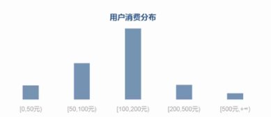
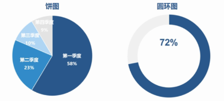
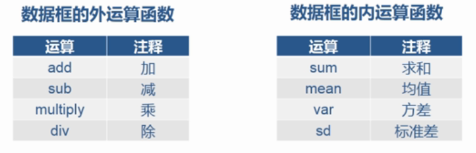

### 关键词
关键词是人们快速了解内容，把握主题的重要方式，广泛应用于新闻报道，科技论文等领域，方便人们高效的管理和检索文档。

关键词提取
```python
tags = jieba.analyse.extract_tags(content,topK=5)
#content 文章内容
#topK 提取n个关键字
tags[0]
```
关键词提取实现

词频：（TF) 某词在文档中出现的次数 TF=某词出现次数
逆文档频率：（IDF） 每个词的权重，大小与常见程度成反比
TF-IDF： 权衡某个分词是否关键词的指标，值越大是关键词的可能性越大
```python
IDF = log(sum/(num+1))
#sum 文档总数
#num 包含该词的文档数

TF - IDF = TF * IDF
```

示例
```python
def hanlder(x):
    return (numpy.log2(len(corpos)/(numpy.sum(x>0)+1)))

IDF = TF.apply(hanlder)

TF_IDF = pandas.DataFrame(TF*IDF)
```

### 交叉分析
通常用于分析两个或两个以上，分组变量之间的关系，以交叉表形式进行变量间关系的对比分析。从数据的不同维度综合进行数据的分许细分，进一步了解数据的分布特征。

交叉计数函数：
```python
pivot_table(values,index,columns,aggfunc,fill_value)
#aggfunc 统计函数
#fill_value NA值的统一替换
```
示例
```python
ptResult = data.pivot_table(
    values=['年龄'],
    index=['年龄分层'],
    columns=['性别'],
    aggfunc=[numpy.size]
)
```

### 数据分组
根据数据分析对象的特征，按照一定的数值指标，吧数据分析对象划分为不同的区间进行研究，以揭示其内在的规律性

```python
cut(series,bins,right=True,labels=NULL)
#series 需要分组的数据
#bins 分组的划分数组
#right 分组右边是否闭合
#labels 分组的自定义标签
```

示例
```python
bins = [
    min(data.cost)-1, 20, 40, 60,
    80, 100, max(data.cost)+1
]

labels = [
    '20以下', '20到40', '40到60',
    '60到80', '80到100', '100以上'
]

data['cut'] = pandas.cut(
    data.cost, bins,
    right=False, labels=labels
)
```

### 分布分析
根据分析目的，将数据（定量数据）进行等距或者不等距的分组，进行研究各组分布规律的一种分析方法，重点在于查看数据的分布情况(百分制)



### 向量化运算
生成等差数列
```python
x = numpy.arange(start,end,step):
#与range()用法差不多，可以为小数

#四则
r + r
r * r

#函数
numpy.power(r,5)

#比较
r>0.3
r[r>0.3]

#矩阵运算
numpy.dot(r,r.T)
sum(r*r)

df.apply(func,axis=0)
#apply 会调用df中的每一列，传递到里面的函数

#结合过滤
df[df.apply(
    lambda x: numpy.all(x>0),
    axis=1
)]

```
四则运算：相同位置的数据进行运算，结果保留在相同的位置
函数计算：相同位置的数据进行函数的计算，函数返回结果保留在相同的位置

### 数据标准化
将数据按比例缩放，使之落入到特定区间

0-1标准化计算公式：x* = (x - min)/(max - min)
方便做十，百分制的运算，只需乘上对应数值即可

```python
#保留n位小数
round(公式，n)
```

案例
```python
data['scale'] = round(
    (data.score - data.score.min())/
    (data.score.max() - data.score.min()),
    2
)
```

### 结构分析
在分组（定性）以及交叉的基础上，计算各组成部分所占的比重，进而分析总体的内部的一种分析方法。



在pandas中进行占比计算，groupby计算出分组结果，或者pivot_table计算出交叉表的结果后，如果还需要对计算的结果继续运算，可以使用数据框自带的函数进行运算



```py
#对列求和
pt.sum(axis=0)

#对每行的列求占比
pt.div(pt.sum(axis=0),axis=1)
```

### 其它
`numpy.any()`方法用于测试数组中是否存在一个或多个True
`numpy.all()`方法用于检查数组中所有值是否都是True
```py
#axis=1,每一行
>>> numpy.all([[1,0],[1,0]],axis=1)
array([False, False], dtype=bool)

>>> numpy.any([[1,0],[1,0]],axis=1)
array([ True,  True], dtype=bool)
```
`numpy.sum()`方法经常被用来对布尔型数组中的True值计数
```python
 #从标准正态分布中返回100个样本值
arr=numpy.random.randn(100)
#正值的数量
sum(arr>0)
(arr>0).sum()
```
