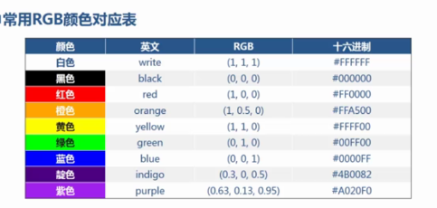
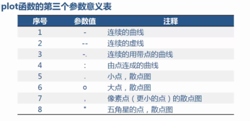

### matplotlib
使用matplotlib最常用的方式是Pylab模式的IPython(%pylab inline)。这样会将IPython配置为使用你所指定的matplotlib GUI后端，Pylab模式还会向IPython引入一大堆模块和函数以提供一种接近于MATLAB的界面。

matplotlib API函数都位于matplotlib.pyplot模块中，其通常的引入约定是：
```python
import matplotlib.pyplot as plt
#matplotlib的示例库和文档是成为绘图高手的最佳学习资源
```
### 散点图&折线图
```py
plot(x,y,style,color=(r,g,b),linewidth)
#x,y x轴与y轴的序列
#style 样式
#color 散点图的颜色，可以用rgb以及英文字母定义(rgb/256)
#linewidth 折线图中线的宽度

title('图的标题')
```





### 饼图
```python
pie(x,labels,colors,explode,autopct)
#x 进行绘图的序列
# labels 饼图的各部分标签序列
#colors 饼图的各部分颜色，rgb
#explode 需要突出的块状序列
#autopct 饼图占比的显示格式，%.2f:保留两位小数
```
示例
```python
#设置突出的部分，即各自离圆心距离
explode = (0.1, 0.2, 0.3)
#设置为横轴和纵轴等长的饼图
#也就是圆形的饼图，而非椭圆形的饼图
plt.axis('equal')
plt.pie(
    result['用户数'],
    labels=result['通信品牌'],
    autopct='%.2f%%',
    explode=explode,
    #饼图旋转角度
    startangle=180
)
```
### 柱形图
```python
bar(left,height,width,color)
#横向柱形图
barh(bottom,width,height,color)
#left x轴的位置序列
#height y轴的数值序列
#width 柱形图的宽度
#color 柱形图填充颜色
```


### 直方图
```python
hist(x,color,bins,cumulative=False)
#x 需要进行绘制的向量
#color 直方图的填充颜色
#bins 设置直方图的分组个数
#cumulative 设置是否累积计数，默认是False
```

### 地图
地图绘制步骤
1. 获取地图对象，获取每个区域的名字及顺序
2. 在区域名字后面，加上需要展示的数据及经纬度
3. 根据数据大小设置区域颜色（标准化处理，使用[0,1]的值，代表颜色透明度）
4. 填色
5. 根据经纬度标注地图的名字
