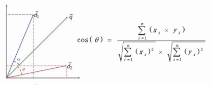

## sklearn
全名Scikit-Learn，是基于Python的机器学习模块，基于BSD开源许可证。

数据结构基于Numpy与pandas，数据计算基于Scipy，数据可视化基于matplotlib。

基本功能主要被分为6个部分，分类，回归，数据降维，模型选择，数据预处理，同时将具体的机器学习分为三个步骤，数据准备与预处理，模型选择与训练，模型验证与参数调优

sklearn包的分词方式是基于空格与标点符号进行分词的（英文）
```python
CountVectorizer(min_df=0,token_pattern=r"\b\w+\b")
#类用于词频统计由三个参数，默认会去掉长度为1的分词
#stop_words 停用词数组
#min_df 分词最小长度
#token_pattern 分词的正则表达式

fit_transform() #文档向量化
todense() #获取文档向量化生成的矩阵
vocabulary_ #查看每个列对应的分词

TfidfTransformer #内置TF-IDF计算方法
get_feature_names() #单词

numpy.argsort #对所有行进行排序取最大值
```

## 相似文章推荐

**余弦相似度**

用向量空间中两个向量夹角的余弦值作为衡量两个个体间差异的大小。余弦值越接近1，就表明夹角越接近0度，也就是两个向量越相似，这个特征也叫做“余弦相似性”



如何计算余弦相似度，首先对文章进行分词，将分词去重后形成语料库，统计分词在文章中出现的次数（向量化），生成的向量要严格按照语料库中的顺序进行排序，如果某篇文章不包含某个分词，需要将该位置的值设置为0，最后根据的到的文章的向量按照余弦值的计算公式得出余弦值


```python
sklearn.metrics.pairwise_distances
#matrix 矩阵
#metric="consine" 距离计算公式
```
