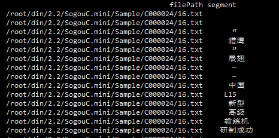

### 中文分词（Chinese Word Segmentation）
将一个汉子序列切分成一个一个单独的词。

### 停用词（Stop Words）
数据处理时，需要过滤掉某些字或词
* 泛滥的词，如：web，网站等；
* 语气助词，副词，介词，连接词等，如的，地，得；

### API小结
■ 中文分词
* 安装方式： `pip install jieba `
* 分词方法：
  ```python
  jieba.cut(content)
  #content 需要分词的句子
  #segment 返回分词的数组
  ```

■ 优化分词效果
* 增加自定义分词：
  ```python
  jieba.add_word(word)
  #word 需要增加的分词
  ```
* 导入自定义词典：
  ```python
  jieba.load_userdict(filePath)
  #filePath 自定义词典所在的文件路径
  ```
课堂代码如下
```python
import os
import os.path
import codecs

filePaths=[];
fileContents=[];
for root,dirs,files in os.walk(
    "/root/din/2.2/SogouC.mini/Sample"
):
    for name in files:
      filePath=os.path.join(root,name);
      filePaths.append(filePath);
      f=codecs.open(filePath,'r','utf-8')
      fileContent=f.read()
      f.close()
      fileContent=fileContent.replace("\r\n","").replace("&nbsp;","")
      fileContents.append(fileContent)

import pandas;
corpos=pandas.DataFrame({
    'filePath':filePaths,
    'fileContent':fileContents
});

import jieba

jieba.load_userdict(
    '/root/din/2.2/金庸武功招式.txt'
);
segments=[]
filePaths=[]
for index ,row in corpos.iterrows():
  filePath=row['filePath']
  fileContent=row['fileContent']
  segs=jieba.cut(fileContent)
  for seg in segs:
    segments.append(seg)
    filePaths.append(filePath)

segmentDataFrame=pandas.DataFrame({
    'segment':segments,
    'filePath':filePaths
});

print (segmentDataFrame)

```
运行结果



### 作业
■ 互联网上有很多现成的词库，如何在网上轻松找到相关领域对应的词库呢？

1. [THUOCL：清华大学开放中文词库](http://thuocl.thunlp.org/)
2. 各输入法网站词库[搜狗词库](http://pinyin.sogou.com/dict/)，[QQ词库](http://dict.qq.pinyin.cn/)，[百度词库](https://shurufa.baidu.com/dict)
3. [词库网](http://www.ciku5.com/)
### 其它
```python
pandas.DataFrame.iterrows()
#遍历，获取每行的index，row

>>> df=pd.DataFrame([[1,1.5]],columns=['int','float'])
>>> row=next(df.iterrows())[1]
>>> row
int 1.0
float 1.5
```
