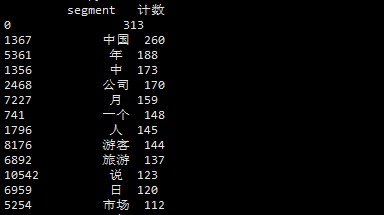
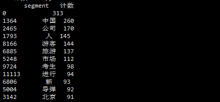

## 词频统计
### 词频（Term Frequency）
某个词在该文档中出现的次数。
> 计算机对文章进行分词，然后对所得到的所有分词进行词频统计，看看哪些词在文章中经常出现。

### 目录
* 词频
* 空格值处理
* 数据导入
* 分组分析
* API小结
* 作业
* 其它

### 空格值处理
空格值如下方表格中的name列的数值一样2，3行字符串后面都有空格
|id |name|
|---|---|
|1 |KEN|
|2 |---JIMI|
|3 |--John|
*- 假装有空格*

清洗空格
```python
newName=df['name'].str.lstrip() #清除左边空格
newName=df['name'].str.rstrip() #清除右边空格
newName=df['name'].str.strip() #清楚左右两边的空格
```

### 数据导入
数据的存在形式：
|类型| 存储形式| 备注|
|---|---|---|
|文件| CSV |用“，”分割列的文件|
|^ |Excel |微软办公软件Excel文件|
|^ |TXT |普通文本|
|^ |... |其它数据|
|数据库 |Mysql |广泛使用的免费开源数据库|
|^ |Access |微软办公软件Access|
|^ |SQL Server |微软企业级数据库|
|^ |... |其它数据库|

■ 导入CSV文件
```python
read_csv(filePath,encoding,index_col)
#第一行为列名，列之间用“，”分隔
#如果文件不规则，行尾有分隔符，则可以设定index_col=False来不使用第一列作为行索引
```
示例
```python
from pandas import read_csv

df=read_csv(
    'D://PDA//4.1//1.csv',
    encoding='utf-8'
)
```
■ 导入文本文件
```python
read_table(filePath,names=[列名1，列名2，...],sep="",encoding, ...)
```
参数
|参数 |注释|
|---|---|
|file |文件路径|
|name |列名，默认为文件中的第一行作为列名|
|sep |分隔符，默认为空，表示默认导入为一列|
|encoding |设置文件编码，在导入中文的时候需要设置为utf-8|
示例
```python
from pandas import read_table

df=read_table(
    'D=//PDA//4.1//2.txt',
    names=['age','name'],
    sep=","
)
```
■ 导入Excel文件
```python
read_excel(fileName,sheetname,names)
```
|参数 |注释|
|---|---|
|fileName |文件路径|
|sheetname |Sheet的名字|
|names |列名，默认为文件中的第一行作为列名|
示例
```python
from pandas import read_excel

df=read_excel(
    'D://PDA//4.1//3.xlsx',
    sheetname='data'
)
#若是中文路径出错，可设置engine='python'
```

### 分组分析
指根据分组字段，将分析对象划分成不同的部分，以进行对比分析各组之间的差异性的的一种分析方法。
■ 分组类型
* 定性分组：按事物的已有属性划分，如：性别，年龄，地区
* 定量分组：数值分组（数据处理章节，如何得到数值分组变量）

■ 常用统计指标
* 计数
* 求和
* 平均值

■ 分组统计函数
  ```python
  DataFrame.groupby(by=['分组列1','分组列2', ...])
  ['统计列1','统计列2', ...]
  .agg({
      '统计列别名1':统计函数1,
      '统计列别名2':统计函数2,
      ...
  })
  ```
  常用统计函数：
  |统计函数|注释|
  |---|---|
  |numpy.size |计数|
  |numpy.sum |求和|
  |numpy.mean |均值|

  ### API小结
■ 列表包含
```python
DataFrame.列名.isin(数组)
```
■ 取反
```python
df[~df.列名.isin(数组)]
#~segStat.segment.isin(stopwords.stopword)
```
### 其它
```shell
#重新设置索引
dataframe.reset_index()

#pandas.DataFrame.sort_values
DataFrame.sort_values(by,ascending=True)
#by 要排序的列名
#ascending True为正序，False为倒序
```

### 作业
■ 词频统计结果中，肯定还有一些你不希望看到的词，继续处理掉这些词吧！
1. 在StopwordsCN.txt加入想要处理的词
2. 网上找一份更完备的停用词

代码：
```python
...
import numpy;
#进行词频统计
segStat=segmentDataFrame.groupby(
    by="segment"
)["segment"].agg({
    "计数":numpy.size
}).reset_index().sort_values(
    "计数",
    ascending=False
);

#移除停用词
stopwords=pandas.read_csv(
    "/root/din/2.3/StopwordsCN.txt",
    encoding='utf-8',
    index_col=False
)

#fSegStat=segStat[
#    ~segStat.segment.isin(stopwords.stopword)
#]

import jieba

segments=[]
filePaths=[]
for index,row in corpos.iterrows():
  filePath=row['filePath']
  fileContent=row['fileContent']
  segs=jieba.cut(fileContent)
  for seg in segs:
    if seg not in stopwords.stopword.values and len(seg.strip())>0:
      segments.append(seg)
      filePaths.append(filePath)

segmentDataFrame=pandas.DataFrame({
    'segment':segments,
    'filePath':filePaths
});

segStat=segmentDataFrame.groupy(
    by="segment"
)["segment"].agg({
    "计数":numpy.size
}).reset_index().sort_values(
    "计数",
    ascending=False
);

print (segStat)
```

原代码效果：


作业效果（去掉了年月日时上下前后中等）：

问题：第一行不知道如何去掉？
