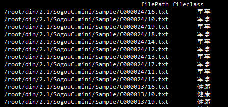

## 文本挖掘
文本挖掘是指从大量文本数据中抽取有价值的知识，并用这些知识更好的组织信息的过程


### ■ **目录**
* 语料库
* API小结
* 作业
* 字段拆分
* DataFrame数据框

### ■ **语料库Corpus**
是我们要分析的所有文档的集合


### ■ **API小结**
构建方法：
```python
for root,dirs,files in os.walk(fileDir)
#fileDir 文件夹路径
#root  文件所在的文件目录
#dirs  root目录下的所有子目录
#files root目录下的所有文件
```
文件读取
```python
codecs.open(filePath,method,encoding)
# filePath 文件路径
# method   打开方式，r只读，w可写，rw读写
# encoding  文件编码，中文utf-8
```
路径拼接
```python
os.path.join()
#用于拼接文件路径
```

### ■ **作业**
```python
# -*- coding: utf-8 -*-
import os
import os.path
import codecs

#作业
fileClass = [];

filePaths = [];
fileContents = [];
for root, dirs, files in os.walk(
    r"/root/din/2.1/SogouC.mini/Sample"
):
    for name in files:
        filePath = os.path.join(root, name);
        filePaths.append(filePath);

        #作业，加入文件的分类#
        Class = open("/roor/din/2.1/SogouC.mini/ClassList.txt")
        #读取每一行
        for line in Class :
	    #去除每行末尾的换行符\n
	    line=line.strip()
	    #将文件所在的目录与ClassList.txt文件中的字符串进行匹配
	    if (root.split('/',6)[6]=line.split(' ',1)[0]):
		    #将文件的分类追加到fileClass中
		    fileClass.append(line.split(' ',1)[1])

	f = codecs.open(filePath, 'r', 'utf-8')
	fileContent = f.read()
	f.close()
	#去除fileContent中的 \r\n 与 &nbsp;
	fileContent=fileContent.replace("\r\n","").replace("&nbsp;","")
	fileContents.append(fileContent)

import pandas;
corpos = pandas.DataFrame({
    'filePath': filePaths,
    'fileContent': fileContents,
    #作业
    'fileClass':fileClass
})

print (corpos)
#作业，把文件的分类，作为语料库数据框的新的一列，加入到语料库中。
```
运行结果



### ■ 字段拆分
字段拆分，是指按照固定的字符，拆分已有字符串
```python
str.split(sep,n,expend=False)
```

|参数  |作用|
|---|---|
|sep |用于分割的字符串|
|n |分割为多少列|
|expend |是否展开为数据框，True返回DataFrame，False返回Series|

### ■ **DataFrame数据框**
* 数据框是用于存储多行和多列的数据集合
* 数据框的的概念图解

|index|age|Name|
|--|--|--|
|0|21|KEN|
|1|22|John|
|2|23|JIMI|

```python
from pandas import DataFrame
df = DataFrame(
    data={
        'age':[21,22,23],
	'name':['KEN','John','JIMI']
    },
	index=['first','second','third'])

#按列访问
df[['age','name']]
#按行访问
df[1:2]
#按行索引访问
df.loc[['first','second']]
#按行列号访问
df.iloc[0:1,0:1]
#按行索引，列名访问
df.at['first','name']

#修改列名
df.columns=['age2','name2']
#修改行索引
df.index=range(1,4)

#根据行索引删除,axis=0
df.drop('first',axis=0)
#根据列名删除,axis=1
df.drop('age2',axis=1)

#增加行,这种方法效率低，不应用于遍历中
df.loc[len(df)]=[24,"KENKEN"]
#增加列
df['newColumn']=[2,4,6,8]
```
