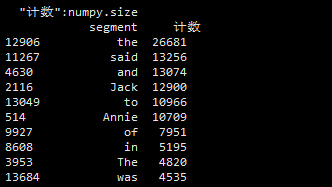
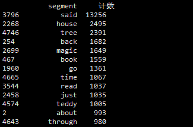

### 数据导出
```python
df.to_csv(filePath,sep=",",index=TRUE,header=TRUE)
```

|参数 |注释|
|---|---|
|filePath |导出的文件路径|
|sep |分隔符，默认为逗号|
|index |是否导出行序号|
|header |是否导出列名|

### 记录抽取
指根据一定的条件，对数据进行抽取
常用的条件类型
* 比较运算 > ,< ,<=,>=,!=
```python
df[df.comments>10000]
```
* 范围运算
```python
df[df.comments.between(1000,10000)]
```
* 空值匹配
```python
df[pandas.isnull(df.title)]
```
* 字符匹配
```python
df[df.title.str.contains('台电',na=False)]
#取反
#df[~df.title.str.contains('台电',na=False)]
```
* 逻辑运算 &，|，not
```python
df[(df.comments>=1000)&(df.comments<=10000)]
```


### 实现功能
1. 分词（人称物主代词，介词，助动词，be动词，代词，连词，数词，冠词，虚词，副词等）
2. 全部转换为小写（.lower()）
3. 去除只出现过一次的单词
4. 筛选出COCA20000以内的词
5. 导出词频文件





### 未实现功能
* 把不同的时态，复数以及其它形式单词打回原形
* 词云图的绘制
* 不同词频段的统计，可视化
