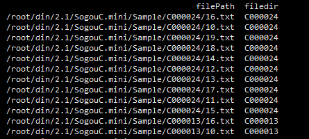

#### 语料库
是我们要分析的所有文档的集合

构建方法：
```python
os.walk(fileDir)
#fileDir为文件夹路径
```
文件读取
```python
codecs.open(filePath,method,encoding)
# filePath 文件路径
# method   打开方式，r只读，w可写，rw读写
# encoding  文件编码，中文utf-8
```


#### 作业
```python
# -*- coding: utf-8 -*-
import os
import os.path
import codecs

#作业
filedirs = [];
filePaths = [];
fileContents = [];
for root, dirs, files in os.walk(
    r"/root/din/2.1/SogouC.mini/Sample"
):
    for name in files:
        filePath = os.path.join(root, name);
        filePaths.append(filePath);

	#作业，加入文件的分类，即文件所在的目录
	filedirs.append(root.split('/',6)[6]);

	f = codecs.open(filePath, 'r', 'utf-8')
	fileContent = f.read()
	f.close()
	fileContents.append(fileContent)

import pandas;
corpos = pandas.DataFrame({
    'filePath': filePaths,
    'fileContent': fileContents,
    #作业
    'filedir':filedirs
})

print (corpos)
#作业，把文件的分类，作为语料库数据框的新的一列，加入到语料库中。
```
运行结果


